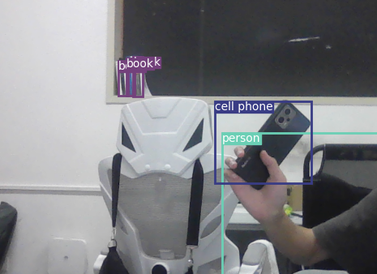

# Directly Using YOLOv3 with Camera
直接把YOLOv3用在摄像头上
## 前置
##### 版本
* pytorch >= 0.4.0
* python >= 3.6.0
##### 安装环境依赖
```
cd Dir-YOLO3
pip3 install -r requirements.txt --user
```
##### COCO 数据集
```
cd data/
bash get_coco_dataset.sh
```
注：本项目直接使用的官方模型权重文件，故跳过了训练部分  
~~数据集一夜没有下载成功~~

## 直接上手
首先[下载官方权重模型](https://drive.google.com/file/d/1SnFAlSvsx37J7MDNs3WWLgeKY0iknikP/view?usp=sharing)然后放在[weights](weights/)
```
cd test
python camera.py params.py
```
<p align="center"></p>

## Credit
```
@article{yolov3,
	title={YOLOv3: An Incremental Improvement},
	author={Redmon, Joseph and Farhadi, Ali},
	journal = {arXiv},
	year={2018}
}
```

## Reference
* [YOLOv3_PyTorch](https://github.com/BobLiu20/YOLOv3_PyTorch)
